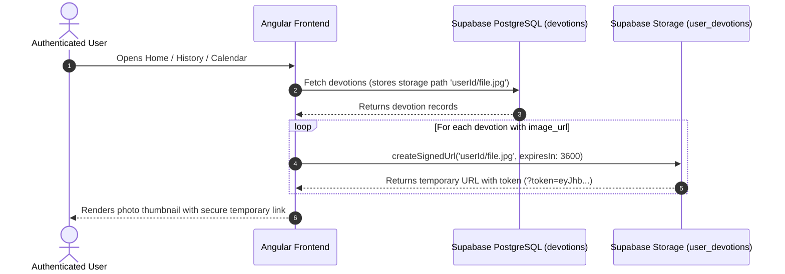

# 🔒 Private Storage & Signed URLs Architecture Plan

---

## 1. 🎯 Overview & Security Motivation

The **Devotion Tracker** allows members to upload photos of their daily handwritten journal notes, Bible page reflections, or personal prayer requests.

### Security Concern with Public Buckets
In a public bucket, any image URL (`https://.../storage/v1/object/public/user_devotions/<user_id>/<file>.jpg`) can be viewed by anyone on the internet who obtains or guesses the URL link, without requiring authentication or session validation.

### Goal of Private Storage + Signed URLs
1. **Zero Unauthenticated Access**: Turn `user_devotions` bucket to `public = false` (Private). Direct requests to public object URLs will return `403 Forbidden` / `404 Not Found`.
2. **Cryptographic Short-Lived Tokens**: Generate temporary **Signed URLs** dynamically with an expiration window (e.g. 1 hour / 3600 seconds) using Supabase Storage API (`createSignedUrl`).
3. **Strict RLS Enforcement**: Row-Level Security (RLS) policies on `storage.objects` will ensure only the authenticated user (or authorized church admins) can generate signed URLs for objects in their folder.

---

## 2. 🗄️ Database & Storage Policy Specifications

### A. Bucket Setting & RLS Migration (`schema.sql`)

```sql
-- 1. Set user_devotions bucket to Private
INSERT INTO storage.buckets (id, name, public) 
VALUES ('user_devotions', 'user_devotions', false)
ON CONFLICT (id) DO UPDATE SET public = false;

-- 2. RLS Policy: Users can select/read only their own folder files
CREATE POLICY "Users Read Own Devotion Images" 
ON storage.objects FOR SELECT 
USING (
  bucket_id = 'user_devotions' 
  AND auth.uid()::text = (storage.foldername(name))[1]
);

-- 3. RLS Policy: Admins with calendar/reports access can read all devotion images
CREATE POLICY "Admins Read All Devotion Images" 
ON storage.objects FOR SELECT 
USING (
  bucket_id = 'user_devotions' 
  AND (
    current_user_has_access('admin_reports') 
    OR current_user_has_access('calender_admin_view')
  )
);

-- 4. RLS Policy: Users can upload files only into their own user_id folder
CREATE POLICY "Users Upload Own Devotion Images" 
ON storage.objects FOR INSERT 
WITH CHECK (
  bucket_id = 'user_devotions' 
  AND auth.uid()::text = (storage.foldername(name))[1]
);

-- 5. RLS Policy: Users can delete files only in their own folder
CREATE POLICY "Users Delete Own Devotion Images" 
ON storage.objects FOR DELETE 
USING (
  bucket_id = 'user_devotions' 
  AND auth.uid()::text = (storage.foldername(name))[1]
);
```

---

## 3. 🏗️ Service Architecture & Data Flow



### B. Angular Data Model & Service Enhancements

1. **Storage Path Persistence**:
   - `DevotionService.uploadDevotionImage(file)` will store the relative storage path (e.g. `5d048117-61de-4717.../1786450299328_image.jpg`) in `devotions.image_url` instead of a static `publicUrl`.

2. **Dynamic Signed URL Resolver**:
   - Add `getSignedImageUrl(imagePath: string, expiresIn = 3600): Promise<string | null>` in `DevotionService`.
   - Parses incoming paths (extracting relative `userId/filename.jpg` even if legacy full public URLs exist).
   - Calls `supabase.storage.from('user_devotions').createSignedUrl(filePath, expiresIn)`.

3. **Fetch Pipeline Transformation**:
   - Update `getTodaysDevotion()`, `getEarlierDevotions()`, and `getDevotionsForUser()` to resolve image paths into signed URLs automatically before returning to UI components.
   - Update `AdminReportsService.getUserDevotionNotes()` to resolve signed URLs for admin drill-down panels.

---

## 4. 📋 Execution Checklist

- [ ] **Step 1**: Execute SQL script to update `user_devotions` bucket to `public = false` and apply private RLS policies.
- [ ] **Step 2**: Add `getSignedImageUrl` helper to `DevotionService`.
- [ ] **Step 3**: Update `uploadDevotionImage` to save clean relative path `userId/file.jpg`.
- [ ] **Step 4**: Wire automatic signed URL resolution into `getTodaysDevotion`, `getEarlierDevotions`, `getDevotionsForUser`, and `getUserDevotionNotes`.
- [ ] **Step 5**: Test unauthenticated image access (must return `403`/`404`) and authenticated access (must load photo cleanly).
- [ ] **Step 6**: Run `npm run build` to verify 100% build success.
